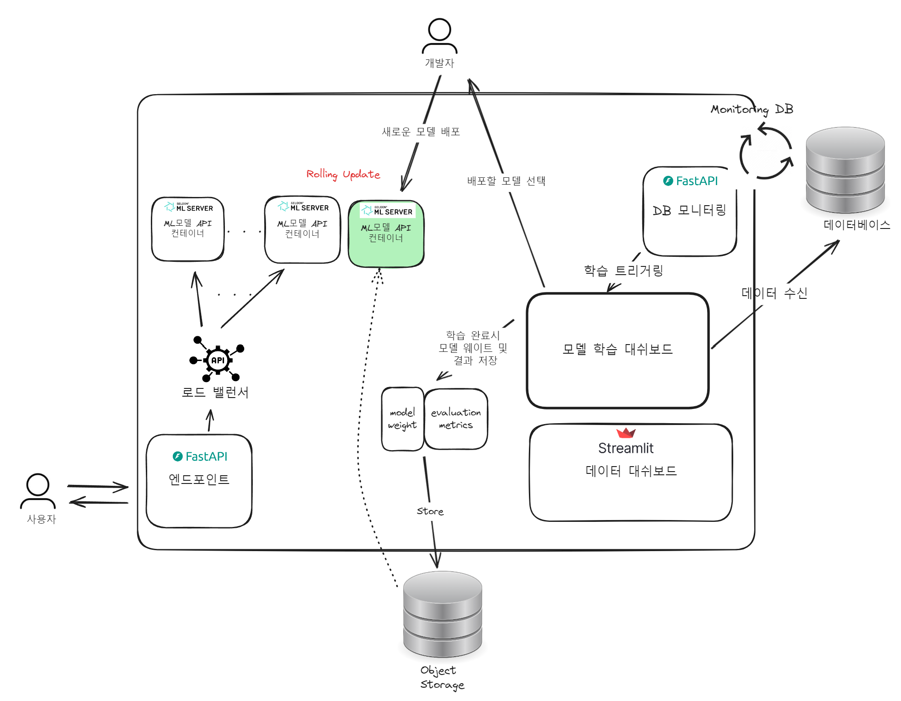
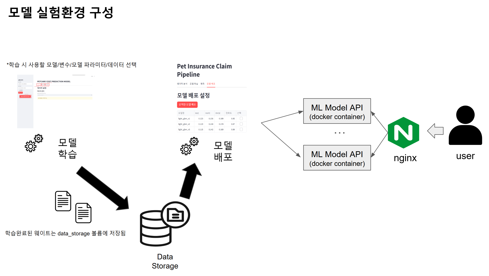

## 치료비 예측 모델 파이프라인
- 반려동물 건강정보를 기반으로 보험청구비를 예측하는 머신러닝 모델 파이프라인입니다.
- 모델학습에 부족한 데이터량을 점진적으로 보완하기 위해 재학습 파이프라인을 구성하였습니다.

### Getting started
``` bash
docker-compose up
```

### 시스템 구성도


- **엔드포인트**
    - `/inference` : 건강정보를 인풋으로 받아 보험비 예측 결과를 반환합니다.
    - `/statistics` : 보유중인 데이터를 분석하여, 해당 견종의 연령별 자주 걸리는 질병명을 반환합니다.

- **DB 모니터링**
    - DB서버에 새로 기록된 데이터를 모니터링합니다.
    - DB서버의 특정 조건이 충족될 시, 재학습을 요청함.
        - 요청 방식
            1. `/train` 엔드포인트를 backend server쪽에 만들어 처리하게 한다.
- **모델 학습 대쉬보드**
    - 모델 학습 실험 환경(자세한 사항은 [여기](pipeline/README.md)에서 확인 가능)
    - 학습을 위한 변수 설정을 위한 시각화 대쉬보드.
    - 모델 학습과 학습이 완료된 모델에 대한 배포 기능.

- **ML 모델 API 컨테이너**
    - `MLServer` 라이브러리 기반 모델 서빙 API. 
    - Backend Server의 inference요청을 전달받아, 추론을 진행한다. 
    - 2개 이상의 컨테이너가 동작한다. nginx의 로드 밸런싱을 통해 요청을 처리한다.
    - 모델 배포 요청을 받을 경우, 차례대로 업데이트된다.
    - 컨테이너가 요청을 처리하고 있는데 재시작 요청을 받을 경우에 대한 별도 처리가 필요하다.


### 모델 학습/배포 실험 환경 구성

- 모델 학습과 배포가 편리하도록 streamlit으로 실험환경 UI를 구성.
- 학습 시 사용할 모델/변수/모델 파라미터/데이터 선택 가능
- 모델 배포 시, 학습이 완료된 웨이트에 대한 성능결과를 비교하고, 버튼으로 배포 가능