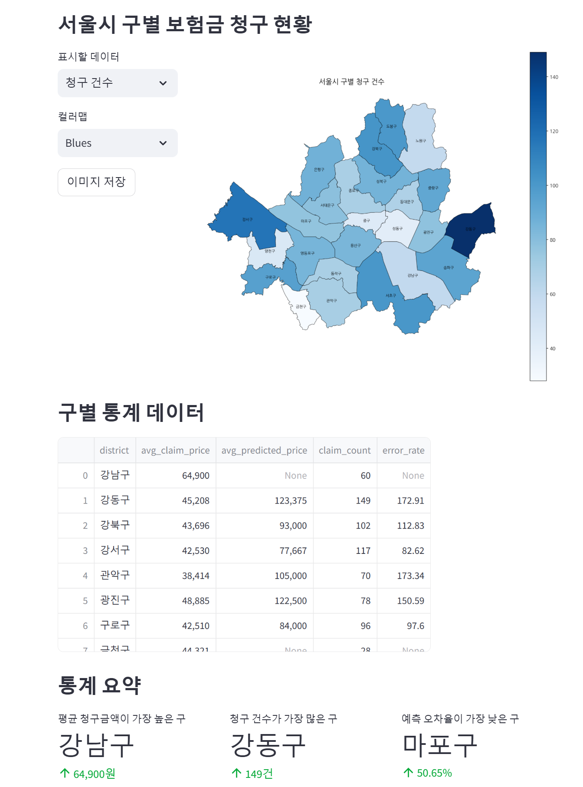
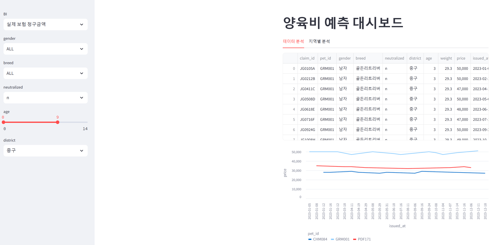
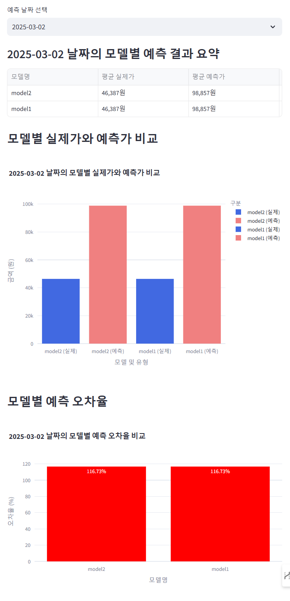
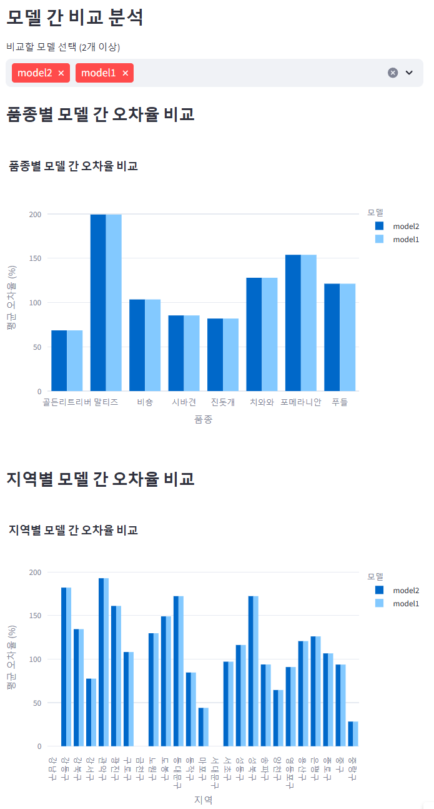
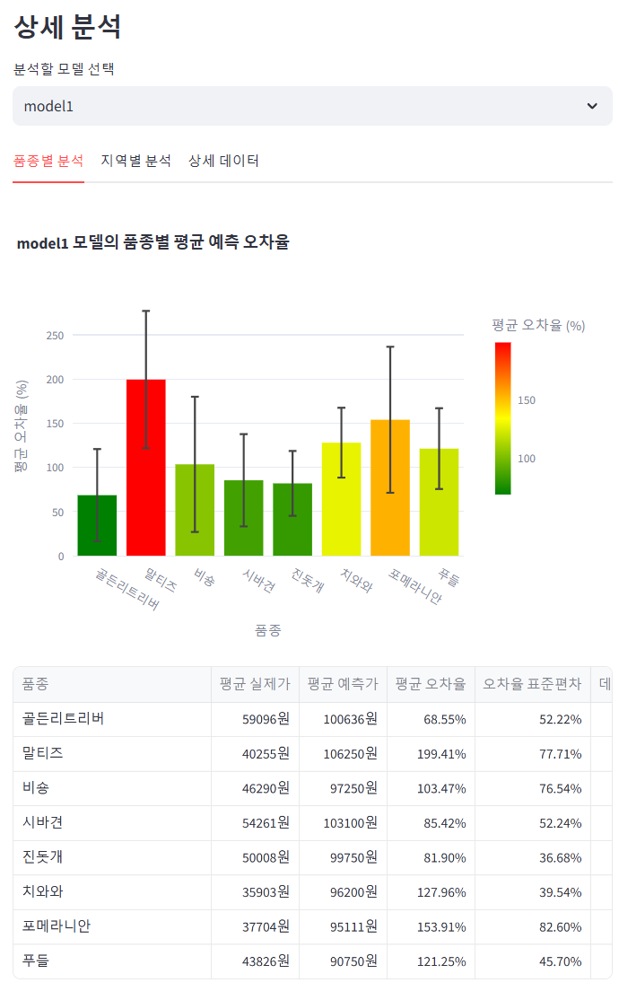

# 반려동물 양육비 예측 대시보드

## 주요 기능
- 반려동물 보험 청구 데이터 분석
- 변수별(지역, 견종별, 중성화여부, 연령) 청구금액 비교
- 모델 예측값의 변수별 오차율 시각화
- 모델별 예측값 비교 


##  `data_storage` 구조
```
prediction
ㄴ{yyyy-mm-dd}
    ㄴ{model_name1}
        ㄴprediction.csv
    ㄴ...
records
ㄴ{yyyy-mm-dd}
    ㄴ insurance_claim.csv
ㄴ ...
```
## 데이터 구조
```csv
# insurance_claim.csv
claim_id,pet_id,gender,breed,neutralized,district,age,weight,price,issued_at
JG0105A,GRM001,남자,골든리트리버,n,중구,3,29.3,50000,2023-01-05
JG0212B,GRM001,남자,골든리트리버,n,중구,3,29.3,50000,2023-02-12
JG0411C,GRM001,남자,골든리트리버,n,중구,3,29.3,47000,2023-04-11
JG0508D,GRM001,남자,골든리트리버,n,중구,3,29.3,50000,2023-05-08
```

```csv
# prediction.csv
claim_id, predicted_price
YS0101A,98000
DJ0101C,73000
GC0101D,81000
```


## 시각화 예시
***시각화에 사용된 데이터는 예시로 만든 샘플데이터임***
### 지역별 분석


###  변수별 청구금액 시각화


### 모델별 예측 결과와 실제 결과 비교


### 모델별 예측 결과 비교(변수별 오차율)


### 모델의 변수별 예측 오차율 분석



## 설치 및 실행 방법
```bash
docker build -t petcare-dashboard .
docker run --rm -p8501:8501 petcare-dashboard
```
