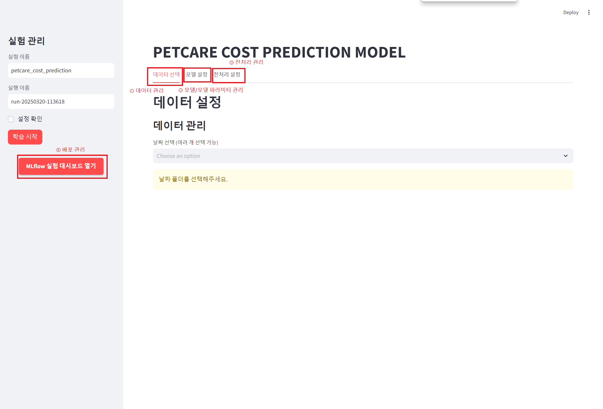
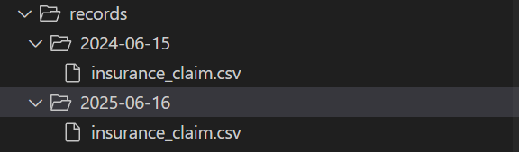
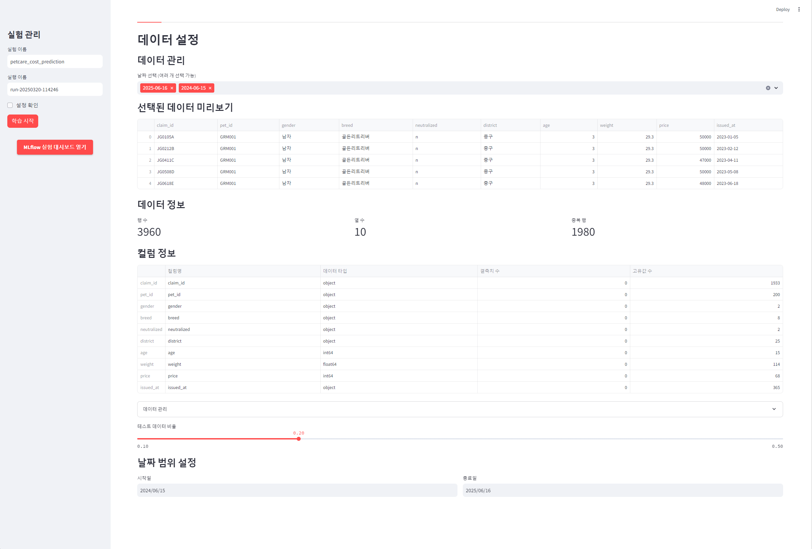
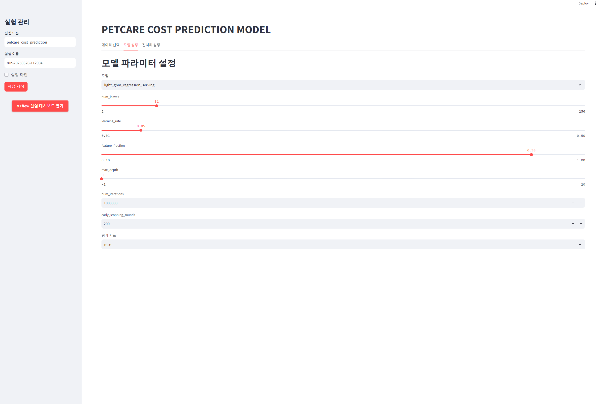
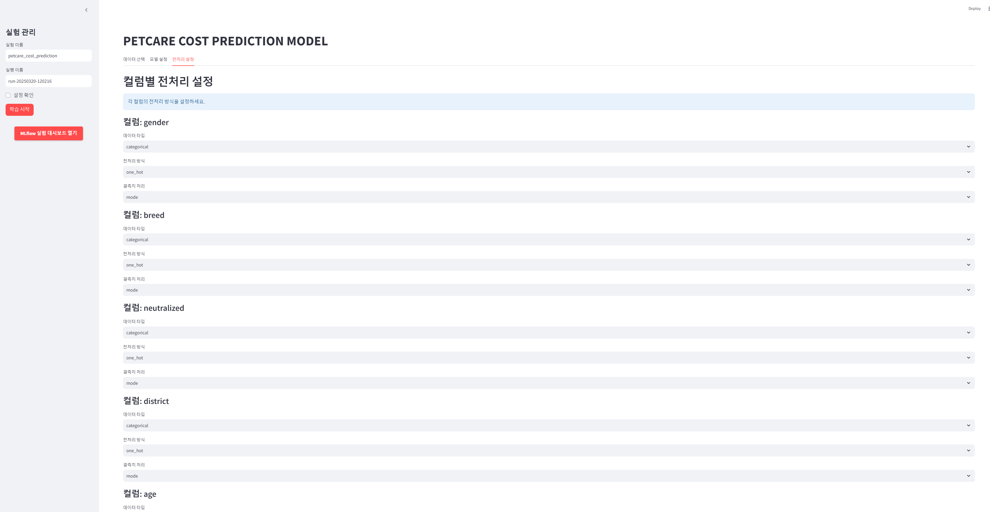
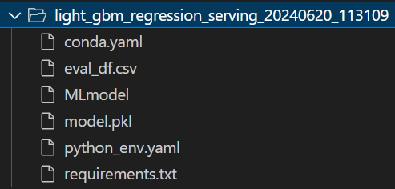

### 양육비 예측 학습 대시보드

- 지속적으로 모델 학습 실험이 가능하도록 대시보드를 구성하였습니다.
- 기본화면에서 데이터, 변수, 모델 파라미터 별 실험 설정이 가능합니다.


<br>

- 실험에서 설정한 정보는 저장되어 mlflow server에서 확인가능합니다.  
- mlflow server에서는 전체 결과를 확인하여 모델 라벨변경을 통해 모델 자동 배포가 가능합니다.


### ① 데이터 관리
- [모니터링 과정](../scheduler/README.md)을 통해 데이터가 csv 형식으로 적재됩니다.
  
(데이터는 일별로 적재되도록 구성하였지만, 양이 적다면 주별/월별로 설정해도 무방합니다.)
- 학습에 사용할 데이터프레임을 날짜별로 복수 선택할 수 있습니다.
- 선택한 데이터프레임의 요약정보(행/열 수, 중복값, 컬럼 정보)를 확인할 수 있습니다.
- 선택한 데이터프레임의 테스트 데이터 비율을 설정할 수 있습니다.



### ② 모델/모델 파라미터 관리

- 모델과 모델의 파라미터들을 설정할 수 있습니다.
- 새로운 모델을 추가할 경우, `src/models/base_model.py`의 `BasePetCareCostPredictionModel` 인터페이스에 맞춰 구현합니다.


### ③ 전처리 관리

- csv파일에 새로운 변수가 추가될 경우, 전처리를 동적으로 처리할 수 있도록 구성하였습니다.
- 변수별 전처리 옵션을 설정합니다. categorical과 numeric 데이터 전처리 그리고 결측치 처리가 가능합니다.
- categorical 데이터 전처리 옵션: ['one hot', 'label']
- numeric 데이터 전처리 옵션: ['standard', 'minmax', 'log transform']
- 결측치 처리 옵션: ['mode', 'media', 'mean', 'zero', 'drop']
- 새로운 전처리 기법은 필요할 경우, `src/preprocess.py`의 `DataPreprocessPipeline`에 추가합니다.


### ④ 배포 관리

- 학습이 완료되면 다음과 같이 모델 서빙을 위한 패키지가 생성됩니다.
- 생성된 패키지는 mlflow server에서 라벨링 이벤트(label: prod)에 맞춰 [mlserver](../mlserver/README.md)에서 배포됩니다.


### config 예시
``` markdown
config = {
    # 기본 설정
    "name": experiment_name,  # 실험 이름
    "run_name": run_name,    # 실행 이름
    "data_dir": "data_storage/records",  # 데이터 디렉토리
    "model_dir": "models",   # 모델 디렉토리
    "mlflow": {
        "tracking_uri": "http://localhost:5000",
        "experiment_name": "petcare_cost_prediction"
    },
    
    # 데이터 설정
    "data": {
        "source": [파일 경로 리스트],
        "dataframe": pd.DataFrame,
        "details": {
            "date_from": "YYYY-MM-DD",
            "date_to": "YYYY-MM-DD",
            "test_split_ratio": 0.2,
            "data_structure": {
                "selected_folders": [선택된 폴더 리스트],
                "archive_path": "아카이브 경로"
            }
        }
    },
    
    # 모델 설정
    "model": {
        "name": "light_gbm_regression_serving",
        "eval_metrics": "mse",
        "params": {
            "num_leaves": 31,
            "learning_rate": 0.05,
            "feature_fraction": 0.9,
            "max_depth": -1,
            "num_iterations": 1000000,
            "early_stopping_rounds": 200,
            "seed": 1234,
            "verbose_eval": 1000
        }
    },
    
    # 전처리 설정
    "preprocessing": {
        "columns": {
            "컬럼명": {
                "type": "numeric" | "categorical",  # 데이터 타입
                "handling": "standard_scale" | "minmax_scale" | "log_transform" | "none" | "one_hot" | "label",  # 전처리 방식
                "missing_value": "mean" | "median" | "zero" | "drop" | "mode"  # 결측치 처리
            }
        },
        "drop_columns": [제외할 컬럼 리스트]
    }
}
```